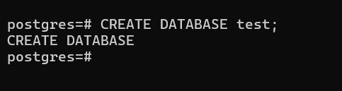
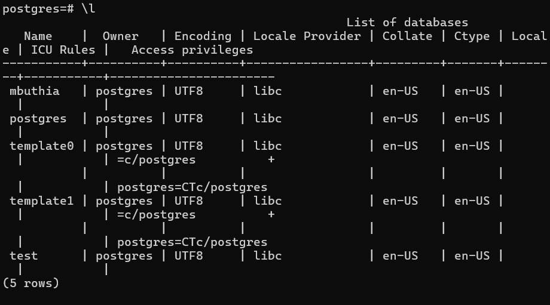
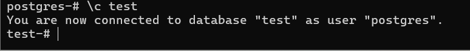
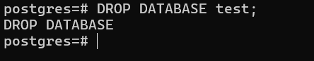

### What is a Database
A Database is where you store, manipulate, and retrieve data.

**SQL** is a programming language.
It helps us manage data in a relational database and it is very easy to learn and very powerful.

### How is data Stored
Data is stored in form of tables. These tables has rows and columns.

**Relational database** means that there is a relationship between the tables, two tables has a relationship between them.

#### What is PostgreSQL?
It is the most the worlds most advanced Open Source relational Database.

It is an Object-Relational database management system, modern and Open Source.
We can connect to the DB server by using the following ways. 

1. Graphical User Interface (GUI) Client `ie Datagrip, postico for mac users and Pg Admin for windows users`
2. Using the Terminal/CMD - this makes you understand all the commands.
3. Using an Application.

**Creating a datatabase in PostgrSQL**

We create a database by running the following syntax. `CREATE DATABSE`

Below is an image showing how to create a database.

We view a database by running the following syntax. `\l` to list all the databases in the system. 

Below is an image showing how to view a database and a display of the available databases. 

## Connecting to a Database
There are two ways to connect tt databases. 
1. By running the following syntax `psql -h localhost -p 432 -U (database user name) (database name)`

2. By running the syntax `\c` then the database name. 

Example

you can switch through databases by  just running that same syntax.

**A very important and Dangerous command**

Deleting a database is very important command that should be handled carefully. To delete a database we use the command `DROP DATABASE (then the database name);`

Example

Note: Always have a copy of your data before performing the `DROP` command on your database to safeguard your information.

